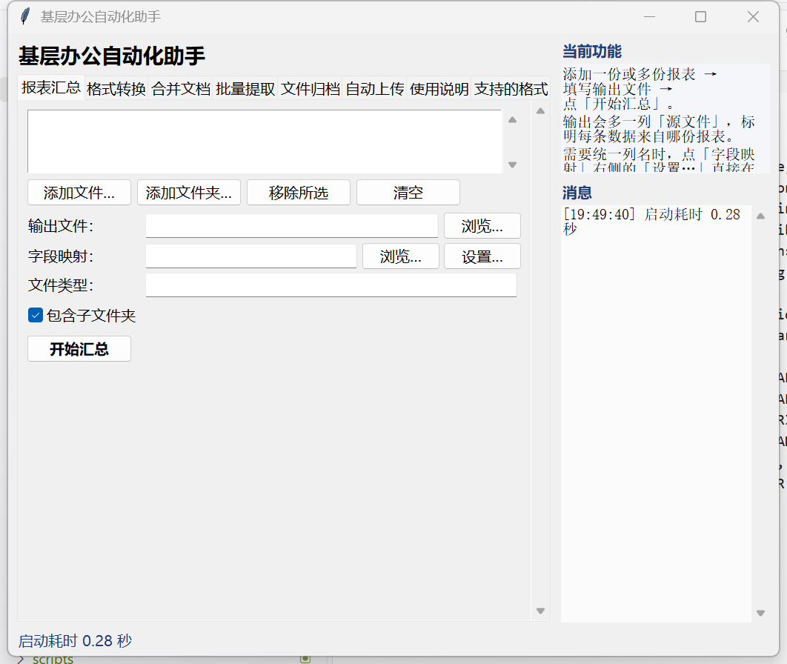
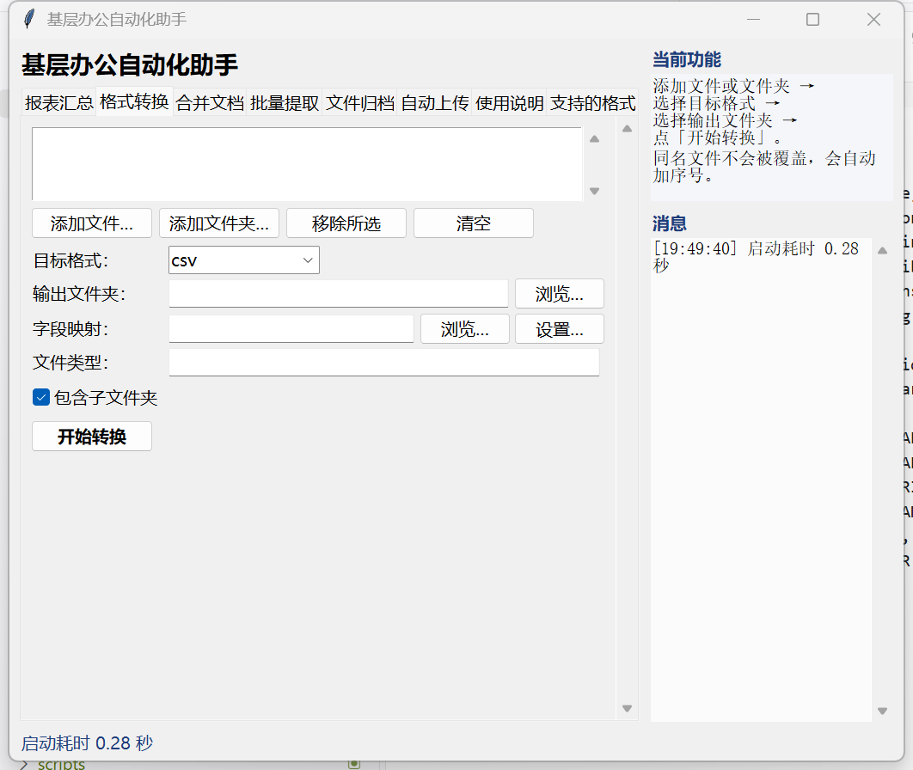
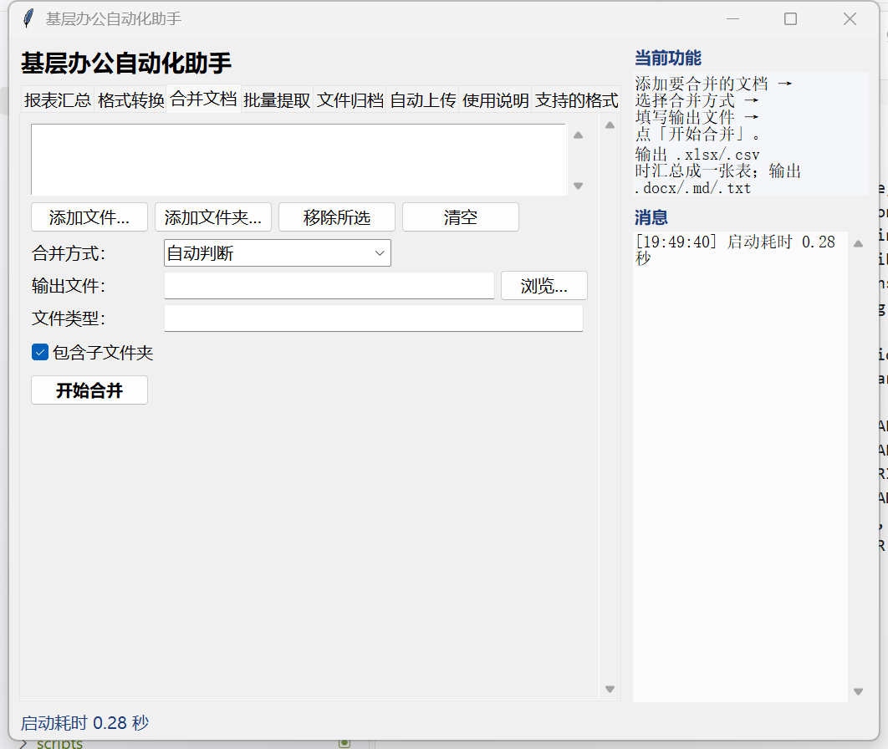
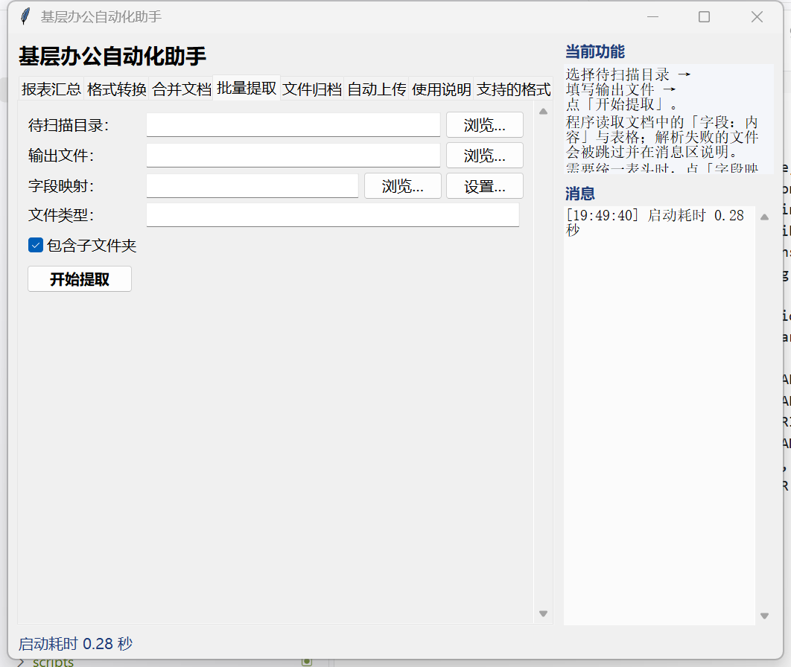
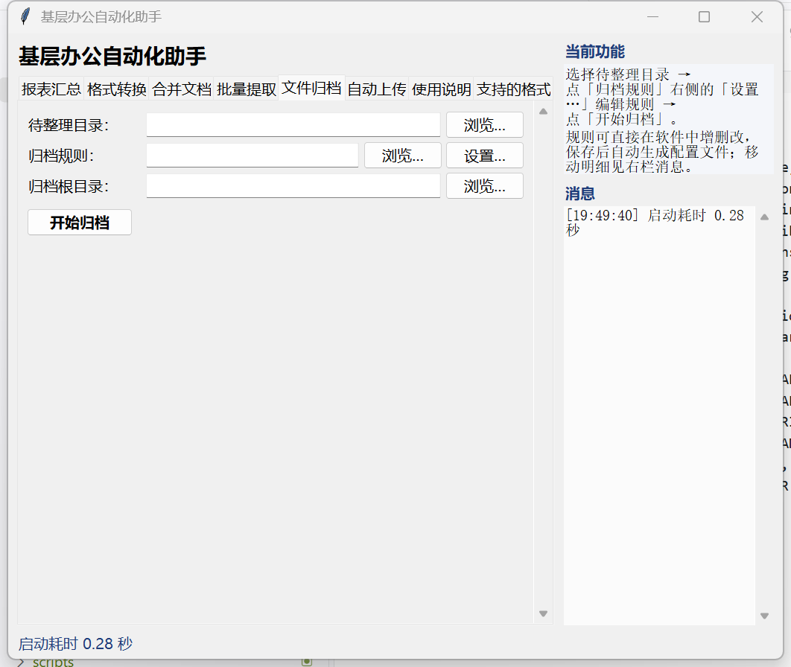
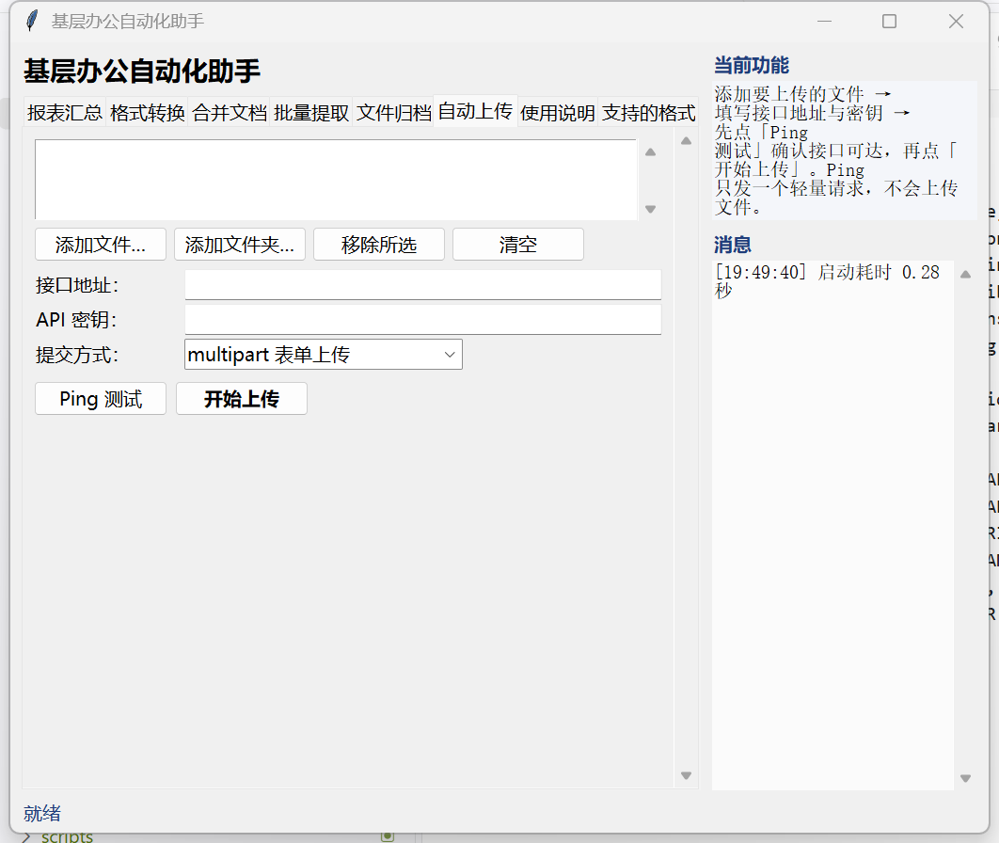

# 基层办公自动化工具箱


[](https://github.com/IcySycamore/information-mapper)

面向基层单位的重复性办公任务的解决方案

提供图形界面与命令行两种入口

> **你可能遇到的问题**
>
> - 报表汇总、文档信息提取手动做，一做就是一上午
> - 格式转换、批量合并找不到好用的工具，天天冲会员或忍受各种广告
> - 文件归档一个个打开文件查看内容太麻烦，想一次性看到所有文件的相关内容
> - 结果上传时，给的网站一堆要求，单次上传有限制，明明可以一起传每次要求最多传xx个

这正是本项目的解决目标

## 界面预览

| 区域     | 位置   | 内容                                                                         |
| -------- | ------ | ---------------------------------------------------------------------------- |
| 标签页组 | 正上方 | 所有功能标签页                                                               |
| 工作区   | 左侧   | 当前标签页的输入项与执行按钮                                                 |
| 信息栏   | 右侧   | 上方说明当前标签页的功能和使用方式，下方显示自软件本次启动来的消息与处理明细 |
| 状态栏   | 正下方 | `就绪` / `需要…` / `成功 · …` / `失败 · …` / 启动耗时                        |

界面共 8 个标签页：报表汇总、格式转换、合并文档、批量提取、文件归档、自动上传、使用说明、支持的格式。

| 报表汇总                                                              | 格式转换                                                                |
| --------------------------------------------------------------------- | ----------------------------------------------------------------------- |
| [](docs/images/gui-report.png) | [](docs/images/gui-convert.png) |

| 合并文档                                                            | 批量提取                                                          |
| ------------------------------------------------------------------- | ----------------------------------------------------------------- |
| [](docs/images/gui-merge.png) | [](docs/images/gui-scan.png) |

| 文件归档                                                                  | 自动上传                                                              |
| ------------------------------------------------------------------------- | --------------------------------------------------------------------- |
| [](docs/images/gui-classify.png) | [](docs/images/gui-upload.png) |

另有「使用说明」与「支持的格式」两个说明页

## 适用场景

| 场景         | 常见问题                       | 对应能力                                       |
| ------------ | ------------------------------ | ---------------------------------------------- |
| 报表统计核算 | 手工汇总多份 Excel，耗时且易错 | `report`：多份报表合并为一张总表，输出含来源列 |
| 文档内容处理 | 人工摘录 Word/PDF 中的字段     | `scan`：批量解析"字段：内容"与表格             |
| 文件资料管理 | 文件混放，人工分类繁琐         | `classify`：按扩展名、关键词、通配符归档       |
| 结果报送     | 成果需逐份上传                 | `upload`：接口上传，支持连通性测试             |
| 数据交付     | 上下游系统要求的格式不一致     | `convert`、`merge`：多格式互转与多文档合并     |

## 支持的格式

- 读取：`.xlsx` `.xlsm` `.xls` `.csv` `.tsv` `.docx` `.pdf` `.txt` `.md` `.log` `.json` `.html`
  以及图片 `.png` `.jpg` `.jpeg` `.bmp` `.tif` `.tiff` `.webp`（OCR）
- 写出：`.xlsx` `.csv` `.docx` `.txt` `.md` `.json` `.html`

图片与扫描版 PDF 通过 OCR 识别文字。`rapidocr-onnxruntime` + `pypdfium2`，首次识别需加载模型，耗时较长

## 环境要求

| 项目                                    | 要求        | 说明                                 |
| --------------------------------------- | ----------- | ------------------------------------ |
| Python                                  | 3.10 及以上 | 经过测试的版本包括3.10 / 3.11 / 3.12 |
| pandas、openpyxl                        | 必需        | 表格读写                             |
| python-docx                             | 必需        | Word 读写                            |
| pypdf                                   | 必需        | PDF 读取                             |
| tkinter                                 | 必需        | 图形界面                             |
| xlrd                                    | 默认安装    | 读取旧版`.xls`                       |
| rapidocr-onnxruntime、pypdfium2、Pillow | 默认安装    | 图片与扫描版 PDF 的 OCR 识别         |
| pytest                                  | 可选        | 运行测试                             |

## 安装

### 一键安装

双击项目根目录的 `一键配置环境.bat`。该脚本定位可用的 Python 解释器后调用
`scripts/setup_env.py`，依次完成版本校验、创建或重建项目环境 `.venv`、安装依赖
、安装扩展组件、自检并生成演示数据。

`setup_env.py` 只维护项目内的 `.venv`：该目录不可用时先删除再重建，不会改动系统 Python 环境。

### 手动安装

```powershell
python -m venv .venv
.\.venv\Scripts\Activate.ps1
pip install -e ".[dev]"
```

## 使用图形界面

```powershell
python scripts\gui_app.py
```

或双击项目根目录的启动界面.bat

## 使用命令行

```powershell
# 列出支持的格式
info-map formats

# 字段映射
info-map map --input data\报名表.xlsx --output output\结果.xlsx --mapping config\mapping.json

# 格式转换：单文件按输出后缀判断，目录批量需指定 --to
info-map convert --input data\名单.xlsx --output output\名单.csv
info-map convert --input data\inbox --output output\csv结果 --to csv

# 批量合并为一个文档
info-map merge --input data\inbox --output output\材料合集.docx

# 报表汇总（输出含"源文件"列）
info-map report --input data\报表 --output output\报表汇总.xlsx --pattern "*.xlsx"

# 批量解析提取
info-map scan --input data\inbox --output output\扫描结果.xlsx

# 自动归档
info-map classify --input data\inbox --config config\classify.example.json
info-map classify --input data\inbox --config config\classify.example.json --apply

# 自动上传
info-map upload --input output --config config\upload.example.json
info-map upload --input output\报表汇总.xlsx --url "https://服务器/api/upload" --token "密钥" --apply
```

不带子命令的旧式调用等价于 `map`：

```powershell
info-map --input data\source.xlsx --output output\result.xlsx --mapping config\mapping.json
```

> [!WARNING]
> `classify` 与 `upload` 的行为
>
> 命令行下默认预操作，需显式加 `--apply` 执行操作。
> 配置仍为占位符时，`upload` 会拒绝真实上传
>
> 图形界面下，不设预演步骤，上传前可用 Ping 测试确认接口可达。

### 合并方式

`merge --mode` 可选值：

| 值             | 行为                                                                                                               | 适用               |
| -------------- | ------------------------------------------------------------------------------------------------------------------ | ------------------ |
| `auto`（默认） | 输出`.xlsx/.csv` → 汇总表；输入全为 `.docx` 且输出 `.docx` → Word 拼接；含表格类输入 → 汇总表；纯正文输入 → 长文档 | 一般情况           |
| `table`        | 所有输入解析为记录后合并为一张表                                                                                   | 报表汇总、信息台账 |
| `word`         | 多个 Word 依次拼接，保留段落与表格                                                                                 | 多份登记表         |
| `text`         | 按顺序拼接正文，每份文件前加小标题                                                                                 | 通知、会议材料汇编 |

## 配置文件

**规则**

既可由界面生成，也可手工编写。图形界面中点击「字段映射」「归档规则」右侧的「设置…」，
编辑结果会写入系统临时目录 `info-map-rules` 下的 JSON，并把路径回填到输入框；
下列示例配置可用：

| 文件                           | 用途                                           |
| ------------------------------ | ---------------------------------------------- |
| `config/mapping.example.json`  | 字段映射：目标表头与候选来源字段               |
| `config/classify.example.json` | 归档规则：目录、默认归类、扩展名/关键词/通配符 |
| `config/upload.example.json`   | 上传配置：地址、密钥、提交方式、超时与重试     |

**网络地址与密钥**

在 `src/information_mapper/uploader.py` 中定义为占位符，
可通过环境变量 `INFO_MAP_UPLOAD_URL`、`INFO_MAP_UPLOAD_TOKEN` 提供。

## 目录结构

```
LICENSE                 MIT 许可证
config/                 示例配置
data/                   演示用输入文件
output/                 输出结果
release/                免安装版产物
packages/               Python 库版产物
src/information_mapper/
  formats.py            格式注册表
  readers.py            多格式读取、目录批量读取
  writers.py            多格式输出、追加写入
  core.py               字段映射
  converters.py         格式转换
  merger.py             多文档合并
  classify.py           文件归档
  rules.py              规则默认值与界面/配置结构互转、临时文件生成
  uploader.py           自动上传
  cli.py                命令行入口
  gui.py                图形界面与服务层
scripts/                独立脚本、一键环境配置与打包脚本
tests/                  测试
docs/                   用户手册、开发手册
  images/               界面截图
```

## 测试

```powershell
pytest -q
```

测试全部离线运行

## 打包发布

项目提供两套可分发形态，产物分开存放，均不进入仓库：

| 形态 / 版本       | 产物                                                                                                     | 适用对象                               |
| ----------------- | -------------------------------------------------------------------------------------------------------- | -------------------------------------- |
| 免安装版·目录版   | `release/基层办公自动化助手/`（248 MB），压缩包 `information-mapper-<版本>-win64-portable.zip`（107 MB） | 快速入门，启动快；需整个目录一起复制   |
| 免安装版·单文件版 | `release/基层办公自动化助手-单文件版/information-mapper-<版本>-win64-single-exe.exe`（119 MB）           | 只发一个文件最省事；启动需先解包，较慢 |
| Python 库版       | `packages/`：wheel + sdist + 源码包                                                                      | 命令行使用或二次开发                   |

```powershell
python -m pip install pyinstaller build             # 仅首次
python scripts\make_release.py                      # 目录版（默认，推荐）+ 产物自检
python scripts\make_release.py --zip                # 目录版另附 zip（Release 上传用）
python scripts\make_release.py --onefile            # 单文件版（一个 exe）
python scripts\make_package.py                      # 库版：wheel + sdist + 源码包
```

两种免安装形态构建后都会用 `--self-check` 启动产物，核对依赖、OCR 模型、识别链路与界面构建，
不通过即视为构建失败。已发布的下载见
[Releases](https://github.com/IcySycamore/information-mapper/releases)。详见 `docs/DEV_GUIDE.md` 第 10 章。

## 文档

| 文档                 | 读者               |
| -------------------- | ------------------ |
| `README.md`          | 部署与维护人员     |
| `docs/USER_GUIDE.md` | 图形界面使用者     |
| `docs/DEV_GUIDE.md`  | 二次开发与维护人员 |

## 反馈问题、提出建议

请转`issue`/`discussion`页

## 技术支持

| 方式     | 信息                                                     |
| -------- | -------------------------------------------------------- |
| QQ       | 1284742412                                               |
| GitHub   | IcySycamore                                              |
| 邮箱     | 1284742412@qq.com                                        |
| 问题反馈 | https://github.com/IcySycamore/information-mapper/issues |

## 已知BUG或使用问题

- PDF：优先使用文本层；无文本层时自动改用 OCR；未实现 PDF 输出
- 复杂表头（多行表头、合并单元格）按首行取值，建议在源文件中先整理表头
- 源文件编码自动探测，非常规编码需先转换。

## 协议

使用本项目/软件/系统意味着您已了解并接受以下协议

### 许可证

本项目以 **MIT** 许可证发布

### 数据所有权

本项目/软件/系统承诺不会上传和修改您在使用过程中的数据和信息，也不为您在使用本项目/软件/系统中因误操作、未探明bug以及擅自修改、分发本项目/软件/系统源码导致的数据安全性和数据泄露问题负责。
